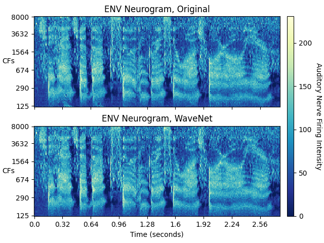

# Analysis of WaveNet Auditory Periphery Simulation's Feature Representations of Speech

### Final Year Project for BSc Computer Science in 2023/24

**Student:** Daniel Conroy \
**Advisor:** Dr. Andrew Hines

The inputs to the general pipeline may be specified in run_pipeline.m.
The general pipeline can be run using the following command:

`matlab -batch "run_pipeline"`

The inputs to the timit pipeline may be specified in run_timit_pipeline.m.
The timit pipeline can be run using the following command:

`matlab -batch "run_timit_pipeline"`

Both pipelines can also be run in MATLAB.

The datasets/sample directory contains publicly available samples of the kind of files contained in the TIMIT speech corpus, including an audio file and accompanying word and phoneme transcriptions files. This directory also contains the MAT-files output by the pipeline for this speech signal input with the SPL and SNR pipeline parameters set to 60 and 25, respectively. Here are plots of the ENV neurograms produced using the neurograms in the neurograms MAT-file:

<p align="center"></p>

#### Requirements

The required Python packages may be installed using the following command:
```
pip install -r requirements.txt
```

The following MATLAB toolboxes are required:\
Audio Toolbox\
Communications Toolbox\
DSP System Toolbox\
Image Processing Toolbox\
Parallel Computing Toolbox\
Signal Processing Toolbox
